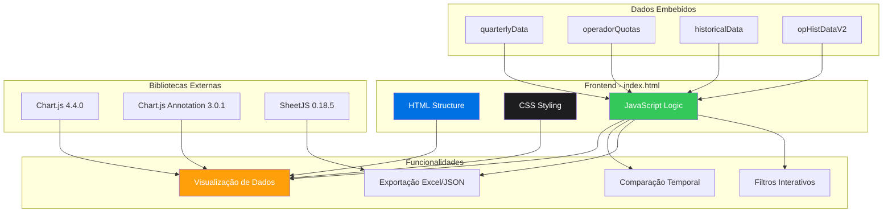

# 🚀 Retomar Projeto ANACOM Dashboard — Março 2026

**Data:** 23 de Março de 2026  
**Versão Atual:** v2.0 (index.html — 3.204 linhas)  
**Localização:** `/Users/denysa_/documents/github/anacom-dashboard/`

---

## 📊 Estado Atual do Projeto

### ✅ Funcionalidades Implementadas

#### **Tab 3T 2025**
- ✅ KPI Cards principais (Móvel, Internet Fixa, Telefone Fixo, Receitas)
- ✅ Gráfico de Penetração com dropdown (STF, STM, BLM, TVS)
- ✅ Gráfico de Receitas Acumuladas com variação YoY
- ✅ Tabela de evolução de quotas trimestrais (estilo Apple)
- ✅ Quotas de mercado por segmento (Móvel, Fixo, Pacotes)
- ✅ Scorecards de Operadores com receitas estimadas (MEO, NOS, Vodafone, DIGI)

#### **Tab Comparar**
- ✅ Comparação entre dois períodos trimestrais
- ✅ Multi-select de operadores (MEO, NOS, Vodafone, DIGI/NOWO)
- ✅ Métricas comparativas com variação percentual
- ✅ Cards dinâmicos com delta e percentagem

#### **Tab Histórico (2006–2024)**
- ✅ **5 Sub-tabs:** Penetração / Subscritores / Tecnologia / Receitas / Mercado
- ✅ Gráficos históricos com dados agregados nacionais
- ✅ Blocos "Quotas por Operador" em 4 de 5 sub-tabs
- ✅ Pills de filtro por operador (MEO, NOS, Vodafone, NOWO)
- ✅ Anotações de eventos-chave (Fusão NOS 2014, Altice 2015)
- ✅ Download JSON histórico
- ✅ Exportação Excel em todos os gráficos

#### **Funcionalidades Transversais**
- ✅ Responsividade Mobile/Tablet (media queries @768px e @480px)
- ✅ Tooltips multi-operador (hover simultâneo)
- ✅ Nota explicativa no sub-tab Tecnologia
- ✅ Design Apple-inspired com cores corporativas
- ✅ Animações e hover effects

### 📈 Estatísticas Técnicas

| Métrica | Valor |
|---------|-------|
| **Linhas de Código** | 3.204 |
| **Tamanho do Ficheiro** | ~152 KB |
| **Gráficos Interativos** | 20+ |
| **Operadores Tracked** | 4 (MEO, NOS, Vodafone, DIGI) |
| **Período Histórico** | 2006–2024 (19 anos) |
| **Dados Atuais** | 3T 2025 |
| **Dependências** | Chart.js 4.4.0, Chart.js Annotation 3.0.1, SheetJS 0.18.5 |

---

## 🎯 Melhorias Pendentes do Plano Original

### ❌ Não Implementadas (do [`ANACOM_Dashboard_Plano_Melhorias.md`](ANACOM_Dashboard_Plano_Melhorias.md))

#### **Fase 3 — Dados Avançados**

1. **Separação DIGI vs NOWO** (Prioridade: Média)
   - Atualmente aparecem agregados como "DIGI/NOWO"
   - DIGI entrou em Nov 2024, NOWO existe desde 2008
   - Requer modificação dos dados JSON em [`opHistDataV2`](../index.html:2744)
   - **Impacto:** Precisão histórica, análise de tendências

2. **Preencher Gaps NOWO 2021-2023** (Prioridade: Baixa)
   - Dados de internet_fixo e telefone_fixo têm `null` em 2021-2023
   - Podem ser preenchidos com dados do Excel ANACOM
   - **Impacto:** Continuidade visual nos gráficos

3. **Filtro de Intervalo de Anos** (Prioridade: Média)
   - Slider duplo para selecionar período (ex: 2015–2020)
   - Atualiza todos os gráficos do sub-tab ativo
   - **Impacto:** Análise focada em períodos específicos

4. **Modo Escuro** (Prioridade: Baixa)
   - Toggle no header + CSS variables
   - Persistência com localStorage
   - **Impacto:** Conforto visual, preferência pessoal

---

## 🗺️ Roadmap de Próximas Funcionalidades

### **Fase 4 — Dados e Análise Avançada** (Q2 2026)

#### 4.1 Atualização de Dados 4T 2025
- [ ] Adicionar dados do 4º trimestre de 2025 quando disponíveis
- [ ] Atualizar tabela de quotas trimestrais
- [ ] Atualizar KPIs principais
- [ ] Atualizar scorecards de operadores
- **Fonte:** ANACOM Factos & Números 4T 2025

#### 4.2 Métricas ARPU (Average Revenue Per User)
- [ ] Adicionar dados de ARPU por operador
- [ ] Criar gráfico de evolução ARPU 2015–2025
- [ ] Comparação ARPU entre operadores
- [ ] Análise de tendências de monetização
- **Fonte:** ANACOM Anexo Estatístico + cálculos derivados

#### 4.3 Análise de Churn
- [ ] Dados de churn por operador (se disponíveis)
- [ ] Gráfico de evolução de churn
- [ ] Correlação churn vs quotas de mercado
- **Fonte:** Relatórios ANACOM ou estimativas

#### 4.4 Separação Completa DIGI/NOWO
- [ ] Modificar [`opHistDataV2`](../index.html:2744) para separar DIGI e NOWO
- [ ] Adicionar pill DIGI separada nos gráficos históricos
- [ ] Atualizar cores: DIGI (#34c759), NOWO (#5ac8fa)
- [ ] Preencher gaps NOWO 2021-2023 com dados do Excel
- **Impacto:** ⭐⭐⭐ (precisão histórica)

### **Fase 5 — Interatividade e UX** (Q3 2026)

#### 5.1 Filtros Dinâmicos
- [ ] Filtro de intervalo de anos (slider duplo)
- [ ] Filtro por tipo de serviço (Móvel, Fixo, TV, Pacotes)
- [ ] Filtro por operador (multi-select global)
- [ ] Persistência de filtros com localStorage
- **Impacto:** ⭐⭐⭐⭐ (análise personalizada)

#### 5.2 Comparação Multi-Operador
- [ ] Gráfico único com todos os operadores selecionados
- [ ] Comparação lado a lado de métricas
- [ ] Tabela de comparação exportável
- **Impacto:** ⭐⭐⭐⭐ (análise competitiva)

#### 5.3 Previsões com Tendências
- [ ] Linear regression para prever tendências 2025–2027
- [ ] Gráfico de previsão com intervalo de confiança
- [ ] Alertas de variações significativas
- **Impacto:** ⭐⭐⭐ (insights preditivos)

#### 5.4 Modo Escuro
- [ ] CSS variables para temas
- [ ] Toggle no header
- [ ] Persistência com localStorage
- [ ] Ajuste de cores dos gráficos
- **Impacto:** ⭐⭐ (conforto visual)

### **Fase 6 — Dados Externos e Automação** (Q4 2026)

#### 6.1 Integração API ANACOM
- [ ] Verificar disponibilidade de API pública ANACOM
- [ ] Implementar fetch automático de dados
- [ ] Atualização trimestral automática
- [ ] Notificações de novos dados
- **Impacto:** ⭐⭐⭐⭐⭐ (automação completa)

#### 6.2 Comparação Internacional
- [ ] Dados de Portugal vs Espanha vs EU
- [ ] Gráficos comparativos de penetração
- [ ] Benchmarking de preços e qualidade
- **Fonte:** Eurostat, BEREC
- **Impacto:** ⭐⭐⭐ (contexto europeu)

#### 6.3 Relatórios PDF Automáticos
- [ ] Geração de relatórios trimestrais em PDF
- [ ] Exportação de gráficos em alta resolução
- [ ] Template personalizado
- **Impacto:** ⭐⭐⭐ (partilha profissional)

---

## 🎯 Prioridades de Desenvolvimento

### **Prioridade 1 — Essencial (Próximas 2 semanas)**

1. **Atualização de Dados 4T 2025**
   - Quando disponíveis pela ANACOM
   - Atualizar todas as secções relevantes
   - Testar integridade dos dados

2. **Separação DIGI/NOWO**
   - Melhorar precisão histórica
   - Facilitar análise de tendências
   - Preparar para futuras atualizações

### **Prioridade 2 — Importante (Próximo mês)**

3. **Filtro de Intervalo de Anos**
   - Melhora significativa de UX
   - Permite análise focada
   - Relativamente simples de implementar

4. **Métricas ARPU**
   - Adiciona valor analítico
   - Diferencia o dashboard
   - Requer cálculos derivados

### **Prioridade 3 — Desejável (Próximos 3 meses)**

5. **Comparação Multi-Operador**
   - Melhora análise competitiva
   - Complementa funcionalidade existente

6. **Previsões com Tendências**
   - Adiciona insights preditivos
   - Requer implementação de algoritmos

7. **Modo Escuro**
   - Melhora conforto visual
   - Baixo esforço, alto impacto UX

### **Prioridade 4 — Futuro (6+ meses)**

8. **Integração API ANACOM**
   - Depende de disponibilidade externa
   - Automação completa

9. **Comparação Internacional**
   - Requer fontes de dados adicionais
   - Expande escopo do projeto

10. **Relatórios PDF**
    - Funcionalidade avançada
    - Requer biblioteca adicional

---

## 🏗️ Arquitetura e Estrutura de Dados

### **Estrutura de Ficheiros**

```
anacom-dashboard/
├── index.html                              ← Dashboard principal (3.204 linhas)
├── README.md                               ← Documentação do projeto
├── ANACOM_Dashboard_Plano_Melhorias.md    ← Plano original (684 linhas)
├── ANACOM_Dashboard_v2_CHANGELOG.md       ← Changelog v2 (231 linhas)
├── DEPLOY_GITHUB_PAGES.md                 ← Guia de deploy
├── GUIA_GITHUB_DESKTOP.md                 ← Guia GitHub Desktop
├── Carrier financial results vs code.xlsx  ← Dados fonte
└── plans/
    └── RETOMAR_PROJETO_2026.md            ← Este ficheiro
```

### **Estrutura de Dados JavaScript**

#### 1. **Dados Trimestrais** ([`quarterlyData`](../index.html:3066))
```javascript
const quarterlyData = {
    totalClientes: { "2024Q3": 11643.2, ..., "2025Q3": 10672.9 },
    acessosMóveis: { "2024Q3": 18880.0, ..., "2025Q3": 18453.65 },
    internetMovel: { ... },
    telefoneFixo: { ... },
    tvSubscricao: { ... },
    internetFixa: { ... },
    receitasTrimestrais: { ... },
    penetracaoMovel: { ... },
    penetracaoFixa: { ... },
    penetracaoBLM: { ... },
    penetracaoTVS: { ... },
    trafegoBLM: { ... }
};
```

#### 2. **Quotas por Operador** ([`operadorQuotas`](../index.html:3105))
```javascript
const operadorQuotas = {
    "MEO":      { receitasTotais: 37.4, vozMovel: 36.1, ... },
    "NOS":      { receitasTotais: 31.6, vozMovel: 31.0, ... },
    "Vodafone": { receitasTotais: 28.5, vozMovel: 27.8, ... },
    "DIGI":     { receitasTotais: 0.2,  vozMovel: 2.7,  ... }
};
```

#### 3. **Dados Históricos Agregados** ([`historicalData`](../index.html:2032))
```javascript
const historicalData = {
    anos: [2006, 2007, ..., 2024],
    penetracao: { stf: [...], stm: [...], blf: [...], tvs: [...] },
    subscritores: { fixo: [...], movel: [...], internet_fixa: [...], tv: [...] },
    tecnologia_internet: { adsl: [...], vdsl: [...], fibra: [...], cabo: [...] },
    tv_tecnologia: { iptv: [...], cabo: [...], satelite: [...] },
    receitas: { anos_receit: [2015,...,2024], pacotes: [...], movel: [...], fixo: [...] },
    multiple_play: { total: [...] }
};
```

#### 4. **Quotas Históricas por Operador** ([`opHistDataV2`](../index.html:2744))
```javascript
const opHistDataV2 = {
    inet: {
        anos: [2008,...,2024],
        MEO: [...], NOS: [...], Vodafone: [...], NOWO: [...],
        titulo: "Quotas Internet Fixo por Operador (2008–2024)",
        unit: "%"
    },
    tv: { ... },
    stf: { ... },
    movel_v2: { ... },
    bundles_sub: { ... },
    bundles_rec: { ... }
};
```

### **Gestão de Estado**

#### Estado de Gráficos de Operadores ([`opChartInst`](../index.html:2796))
```javascript
const opChartInst = {
    pen: { type: 'inet',       pills: {MEO:true, NOS:true, Vodafone:true, NOWO:true} },
    sub: { type: 'tv',         pills: {MEO:true, NOS:true, Vodafone:true, NOWO:true} },
    rec: { type: 'bundles_rec',pills: {MEO:true, NOS:true, Vodafone:true, NOWO:true} }
};
```

#### Cores dos Operadores ([`COLORS`](../index.html:1524))
```javascript
const COLORS = {
    meo: '#0071e3',        // Apple Blue
    nos: '#1d1d1f',        // Apple Black
    vodafone: '#e30613',   // Vodafone Red
    digi: '#34c759',       // Apple Green
    nowo: '#5ac8fa',       // Apple Light Blue
    outros: '#b0b0b8'      // Apple Gray
};
```

### **Fluxo de Navegação**

```mermaid
graph TD
    A[index.html] --> B[Tab 3T 2025]
    A --> C[Tab Comparar]
    A --> D[Tab Histórico]
    
    B --> B1[KPI Cards]
    B --> B2[Gráfico Penetração]
    B --> B3[Gráfico Receitas]
    B --> B4[Tabela Quotas]
    B --> B5[Quotas por Segmento]
    B --> B6[Scorecards Operadores]
    
    C --> C1[Seleção Períodos]
    C --> C2[Multi-select Operadores]
    C --> C3[Cards Comparação]
    
    D --> D1[Sub-tab Penetração]
    D --> D2[Sub-tab Subscritores]
    D --> D3[Sub-tab Tecnologia]
    D --> D4[Sub-tab Receitas]
    D --> D5[Sub-tab Mercado]
    
    D1 --> D1A[Gráfico Agregado]
    D1 --> D1B[Quotas por Operador]
    
    D2 --> D2A[Gráfico Agregado]
    D2 --> D2B[Quotas por Operador]
    
    D3 --> D3A[Internet por Tecnologia]
    D3 --> D3B[TV por Tecnologia]
    D3 --> D3C[Nota Explicativa]
    
    D4 --> D4A[Gráfico Receitas]
    D4 --> D4B[Quotas por Operador]
    
    D5 --> D5A[Multiple Play]
    D5 --> D5B[Nº Operadores]
    D5 --> D5C[Quotas por Operador]
```



### **Funções Principais**

| Função | Localização | Descrição |
|--------|-------------|-----------|
| [`switchMainTab()`](../index.html:1547) | Linha 1547 | Troca entre tabs principais |
| [`switchSubTab()`](../index.html:1568) | Linha 1568 | Troca entre sub-tabs |
| [`switchPenetracao()`](../index.html:1915) | Linha 1915 | Atualiza gráfico de penetração |
| [`createReceitasChart()`](../index.html:1978) | Linha 1978 | Cria gráfico de receitas com YoY |
| [`buildOpChartFor()`](../index.html:2818) | Linha 2818 | Constrói gráfico de quotas por operador |
| [`updateComparisonCards()`](../index.html:3147) | Linha 3147 | Atualiza cards de comparação |
| [`downloadHistoricoJSON()`](../index.html:3051) | Linha 3051 | Download de dados históricos |
| [`exportToExcel()`](../index.html:1490) | Linha 1490 | Exportação para Excel |

---

## 📋 Próximos Passos Recomendados

### **Ação Imediata (Esta Semana)**

1. **Verificar Disponibilidade de Dados 4T 2025**
   - Consultar site ANACOM
   - Preparar estrutura para atualização
   - Testar processo de atualização

2. **Planear Separação DIGI/NOWO**
   - Analisar dados do Excel `Carrier financial results vs code.xlsx`
   - Identificar pontos de separação nos dados históricos
   - Criar branch de desenvolvimento

### **Desenvolvimento (Próximas 2 Semanas)**

3. **Implementar Separação DIGI/NOWO**
   - Modificar [`opHistDataV2`](../index.html:2744)
   - Adicionar pill DIGI nos gráficos históricos
   - Preencher gaps NOWO 2021-2023
   - Testar em todos os sub-tabs

4. **Implementar Filtro de Intervalo de Anos**
   - Criar componente de slider duplo
   - Integrar com gráficos históricos
   - Adicionar persistência com localStorage

### **Testes e Validação**

5. **Testar Responsividade**
   - iPhone SE (375px)
   - iPhone 14 Pro (393px)
   - iPad Mini (768px)
   - iPad Pro (1024px)
   - Desktop (1920x1080)

6. **Validar Dados**
   - Verificar consistência entre tabs
   - Confirmar cálculos de quotas
   - Validar exportações Excel/JSON

---

## 🔗 Recursos e Referências

### **Documentação do Projeto**
- [`README.md`](../README.md) — Documentação principal
- [`ANACOM_Dashboard_Plano_Melhorias.md`](../ANACOM_Dashboard_Plano_Melhorias.md) — Plano original de melhorias
- [`ANACOM_Dashboard_v2_CHANGELOG.md`](../ANACOM_Dashboard_v2_CHANGELOG.md) — Changelog da versão 2.0
- [`DEPLOY_GITHUB_PAGES.md`](../DEPLOY_GITHUB_PAGES.md) — Guia de deploy
- [`GUIA_GITHUB_DESKTOP.md`](../GUIA_GITHUB_DESKTOP.md) — Guia GitHub Desktop

### **Fontes de Dados**
- **ANACOM:** https://www.anacom.pt/
- **Factos & Números:** https://www.anacom.pt/render.jsp?categoryId=375319
- **Anexo Estatístico 2024:** Ficheiro Excel local

### **Tecnologias**
- **Chart.js:** https://www.chartjs.org/ (v4.4.0)
- **Chart.js Annotation:** https://www.chartjs.org/chartjs-plugin-annotation/ (v3.0.1)
- **SheetJS:** https://sheetjs.com/ (v0.18.5)

### **GitHub**
- **Repositório:** https://github.com/Denysa87/anacom-dashboard
- **GitHub Pages:** https://denysa87.github.io/anacom-dashboard

---

## 📊 Diagrama de Arquitetura



---

## ✅ Checklist de Retoma

- [x] Analisar estado atual do projeto
- [x] Identificar melhorias pendentes
- [x] Criar roadmap de funcionalidades
- [x] Definir prioridades de desenvolvimento
- [x] Documentar arquitetura e estrutura de dados
- [ ] Verificar disponibilidade de dados 4T 2025
- [ ] Planear separação DIGI/NOWO
- [ ] Implementar filtro de intervalo de anos
- [ ] Adicionar métricas ARPU
- [ ] Testar responsividade em todos os dispositivos
- [ ] Validar integridade de dados
- [ ] Atualizar README com novas funcionalidades
- [ ] Criar branch de desenvolvimento para novas features

---

**Desenvolvido com ❤️ para análise do mercado português de telecomunicações**

*Última atualização: 23 de Março de 2026*
